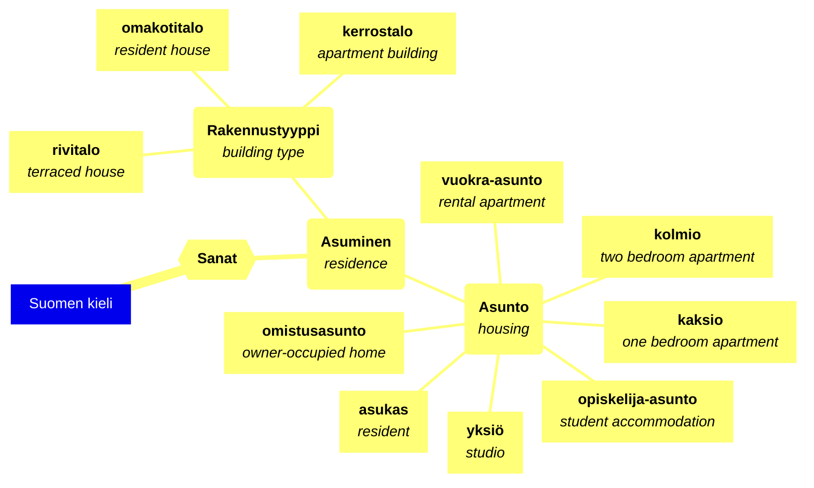

Here is the mindmap diagram I draw when I learn Finnish.

```mermaid
---
title: Suomen kieli
---
mindmap
root[Suomen kieli]
  Sanat{{**Sanat**}}
    Asuminen(**Asuminen**
        *residence*)
      Rakennustyyppi(**Rakennustyyppi**
          *building type*)
        omakotitalo[**omakotitalo**
            *resident house*]
        kerrostalo[**kerrostalo**
            *apartment building*]
        rivitalo[**rivitalo**
            *terraced house*]      
      Asunto(**Asunto**
          *housing*)
        yksiö[**yksiö**
            *studio*]
        kaksio[**kaksio**
            *one bedroom apartment*]
        kolmio[**kolmio**
            *two bedroom apartment*]
        vuokra-asunto[**vuokra-asunto**
            *rental apartment*]
        omistusasunto[**omistusasunto**
            *owner-occupied home*]
        opiskelija-asunto[**opiskelija-asunto**
            *student accommodation*]
        asukas[**asukas**
            *resident*]
```